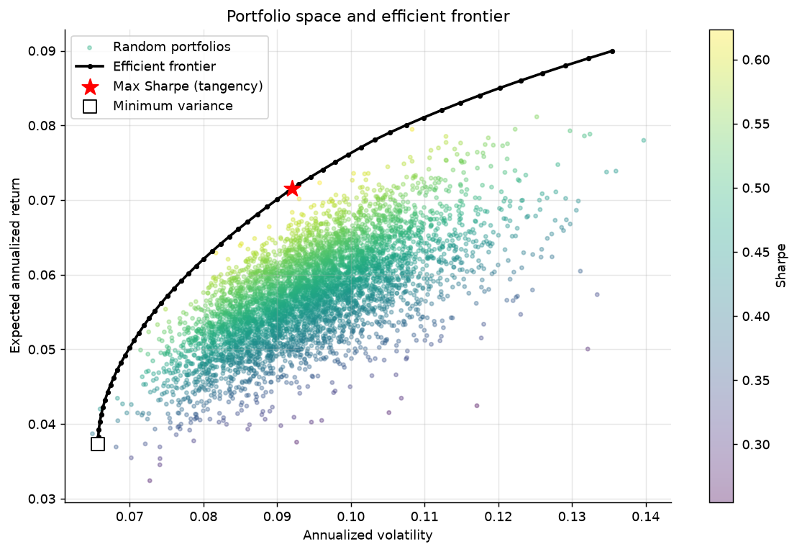
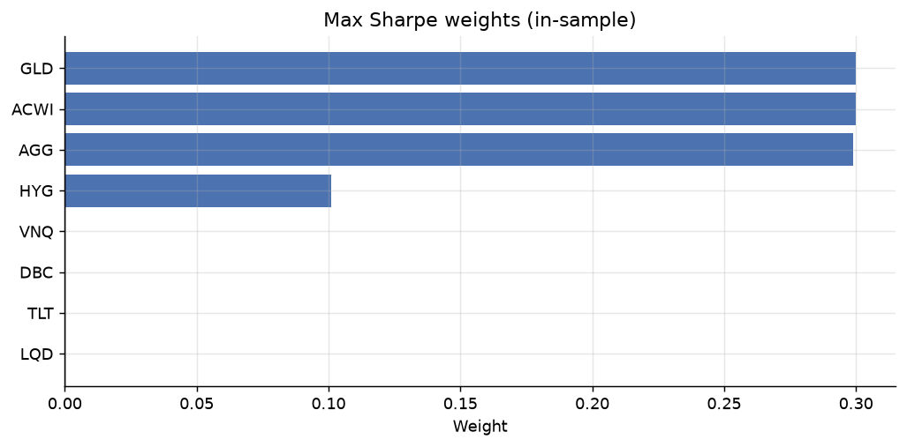
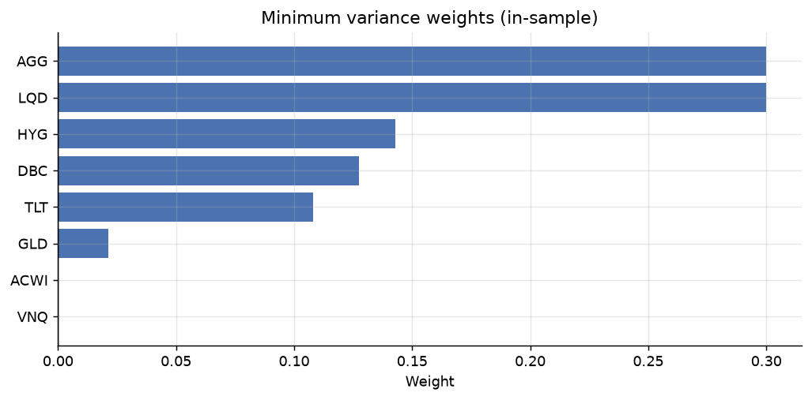
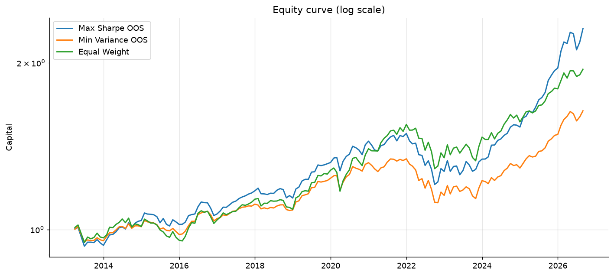
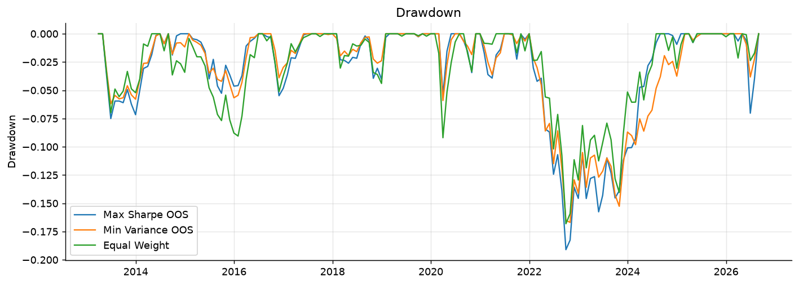
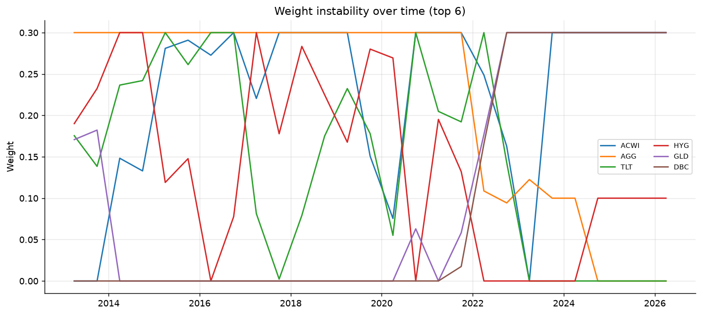
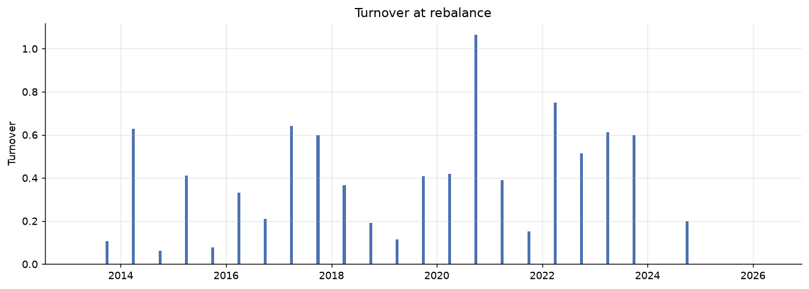
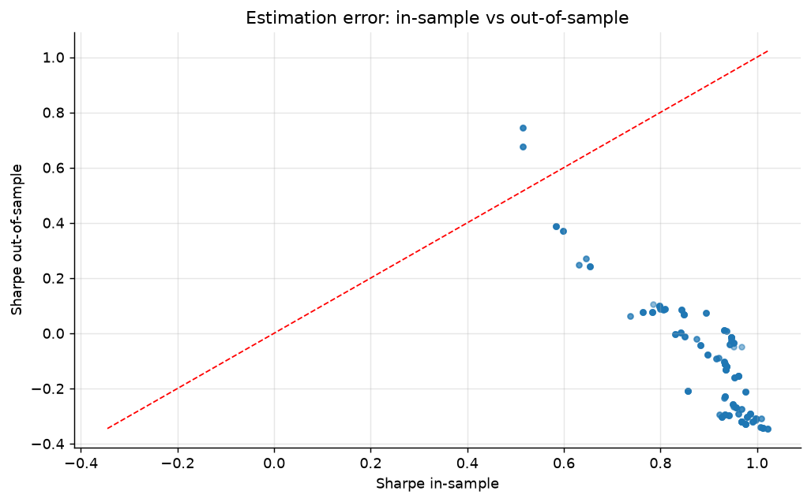

# Markowitz Portfolio Management

Project for portfolio analysis and optimization using the Markowitz mean-variance model.

The project downloads historical data, builds monthly returns, estimates expected return and covariance, computes optimal portfolios, and validates the strategies with a walk-forward out-of-sample backtest.

## Objective

Compare three allocation strategies:

- **Max Sharpe**: maximizes the ratio between expected excess return and volatility.
- **Min Variance**: minimizes portfolio volatility.
- **Equal Weight**: 1/N benchmark, with equal weight on all risky assets.

The risk-free rate is represented by `BIL` and is excluded from the optimization of risky assets, but used in the Sharpe and Sortino calculations.

## Investment universe

The assets are defined in [config/assets.yaml](config/assets.yaml):

| Ticker | Role |
|---|---|
| ACWI | Global equity |
| AGG | US aggregate bonds |
| TLT | US long-term Treasury |
| LQD | Investment grade credit |
| HYG | High yield |
| VNQ | US real estate |
| DBC | Commodities |
| GLD | Gold |
| BIL | Risk-free proxy, excluded from optimization |

The universe is validated before the analysis. If tickers not present in the configuration appear in the processed data, the Markowitz script stops instead of producing ambiguous results.

## Structure

```text
markowitz-stage/
├── config/
│   ├── config.yaml
│   └── assets.yaml
├── data/
│   ├── raw/prices/
│   ├── interim/
│   └── processed/
├── outputs/
│   ├── figures/
│   ├── tables/
│   └── data_quality/
├── scripts/
│   ├── run_01_download.py
│   ├── run_02_clean.py
│   ├── run_03_validate.py
│   └── run_04_markowitz.py
├── src/
│   ├── data/
│   ├── markowitz/
│   │   └── shrinkage.py
│   ├── analytics/
│   ├── utils/
│   └── viz/
├── tests/
├── requirements.txt
└── README.md
```

## Execution pipeline

Always run the commands from the project root:

```powershell
cd C:\Users\user\PortfolioManagement\markowitz-stage
.\.venv\Scripts\python.exe scripts\run_01_download.py
.\.venv\Scripts\python.exe scripts\run_02_clean.py
.\.venv\Scripts\python.exe scripts\run_03_validate.py
.\.venv\Scripts\python.exe scripts\run_04_markowitz.py
```

### 1. Download

[run_01_download.py](scripts/run_01_download.py) reads the universe from `assets.yaml`, adds BIL as risk-free, and downloads prices from Yahoo Finance into:

```text
data/raw/prices/prices_raw.parquet
```

### 2. Cleaning and transformation

[run_02_clean.py](scripts/run_02_clean.py):

- sorts and cleans prices;
- applies limited forward fill;
- removes assets with insufficient history;
- computes logarithmic returns for storage;
- aggregates returns to monthly frequency;
- identifies outliers;
- saves data, metadata, and quality reports.

Main outputs:

```text
data/processed/prices.parquet
data/processed/returns.parquet
data/processed/returns_monthly.parquet
data/processed/metadata.parquet
data/processed/outliers.parquet
data/processed/universe.yaml
```

### 3. Validation

[run_03_validate.py](scripts/run_03_validate.py) checks that the required files exist and that monthly returns:

- are readable;
- contain no missing values;
- have a sorted index;
- contain no duplicate dates.

### 4. Markowitz analysis

[run_04_markowitz.py](scripts/run_04_markowitz.py):

1. separates BIL from the risky assets;
2. estimates annualized mean return and annualized covariance matrix;
3. computes the Min Variance and Max Sharpe portfolios;
4. builds the efficient frontier;
5. runs the walk-forward backtest;
6. compares Max Sharpe, Min Variance, and Equal Weight;
7. measures estimation error, weight instability, and turnover;
8. saves tables and figures.

## Theory used

For a weight vector $w$, expected return $\mu$, and covariance matrix $\Sigma$:

$$
E[R_p] = w^T\mu
$$

$$
\sigma_p = \sqrt{w^T\Sigma w}
$$

$$
Sharpe_p = \frac{E[R_p] - r_f}{\sigma_p}
$$

Returns are stored as log-returns, but converted to simple returns before estimation, aggregation, and metric computation:

$$R_{simple,t}=\exp(r_{log,t})-1$$

$$V_t=\prod_{i=1}^{t}(1+R_{simple,i})$$

The current optimization is long-only, with weights summing to 1 and a maximum weight per asset of 0.30, consistent with the GMP comparison. Short positions are not allowed.

## Current results

The results reported below are those regenerated with the same risky universe as the GMP: ACWI/AGG/TLT/LQD/HYG/VNQ/DBC/GLD and BIL as risk-free.

### Out-of-sample performance

| Strategy | CAGR | Volatility | Sharpe | Sortino | Max Drawdown | Calmar |
|---|---:|---:|---:|---:|---:|---:|
| Max Sharpe OOS | 6.38% | 7.79% | 0.63 | 0.84 | -19.10% | 0.33 |
| Min Variance OOS | 3.72% | 6.09% | 0.36 | 0.47 | -16.69% | 0.22 |
| Equal Weight | 5.06% | 7.90% | 0.46 | 0.65 | -16.81% | 0.30 |

Interpretation:

- Max Sharpe achieves the highest return and Sharpe, but also the highest risk and drawdown.
- Min Variance significantly reduces volatility and drawdown, at the cost of lower return.
- Equal Weight is an intermediate benchmark and offers a useful comparison against parametric optimization.

### In-sample weights

#### Max Sharpe

| Asset | Weight |
|---|---:|
| ACWI | 30.00% |
| AGG | 29.89% |
| HYG | 10.11% |
| GLD | 30.00% |

The other assets receive zero or numerically near-zero weight.

#### Min Variance

| Asset | Weight |
|---|---:|
| AGG | 30.00% |
| LQD | 30.00% |
| HYG | 14.30% |
| DBC | 12.74% |
| TLT | 10.81% |
| GLD | 2.14% |
| Other assets | 0.00% |

### Estimation error

The experiment in [critique.py](src/markowitz/critique.py) shows the difference between the Sharpe estimated on the training sample and the Sharpe on the subsequent period:

- typical in-sample Sharpe: around `0.64-0.76`;
- out-of-sample Sharpe often close to zero or negative;
- in some splits the out-of-sample is positive, but very volatile.

This result is consistent with theory: the Max Sharpe portfolio depends heavily on mean return estimates, which are noisy and unstable.

### Turnover

Annual turnover at rebalancing is often high, with values reaching around `1.83`. This means the optimal allocation changes substantially from one window to the next.

The current results **do not include transaction costs**. The real net return would therefore likely be lower, especially for Max Sharpe.

## First extension: Ledoit-Wolf shrinkage

An experimental shrinkage section was added in [shrinkage.py](src/markowitz/shrinkage.py). The baseline still uses the sample covariance; in parallel, a Ledoit-Wolf covariance is estimated:

$$
\hat{\Sigma}_{shrunk} = (1-\lambda)\hat{\Sigma} + \lambda F
$$

The parameter $\lambda$ is estimated automatically by Ledoit-Wolf. In the latest run:

```text
shrinkage_alpha = 0.0733
```

The in-sample comparison is available in [shrinkage_comparison.csv](outputs/tables/shrinkage_comparison.csv):

| Model | Expected return | Volatility | Sharpe |
|---|---:|---:|---:|
| Sample covariance - Max Sharpe | 6.38% | 9.81% | 0.522 |
| Sample covariance - Min Variance | 2.44% | 4.39% | 0.269 |
| Ledoit-Wolf - Max Sharpe | 6.72% | 10.33% | 0.529 |
| Ledoit-Wolf - Min Variance | 2.60% | 5.70% | 0.234 |

These numbers are **in-sample** and must not be interpreted as a definitive improvement. The next required check is a walk-forward OOS with the same shrunk covariance recomputed at each rebalancing.

The experimental weights are saved in:

- [shrinkage_tangency_weights.csv](outputs/tables/shrinkage_tangency_weights.csv)
- [shrinkage_minvar_weights.csv](outputs/tables/shrinkage_minvar_weights.csv)

The original baseline remains in the `tangency_weights.csv` and `minvar_weights.csv` files, so the comparison remains reproducible.

## Main figures

### Portfolio space and frontier

The unified figure shows random portfolios, the efficient frontier, Max Sharpe, and Min Variance in the same chart.



### Max Sharpe weights



### Min Variance weights



### Out-of-sample equity curve



### Drawdown



### Weight instability



### Turnover



### Estimation error



Other available figures:

- [Capital Allocation Line](outputs/figures/capital_allocation_line.png)
- [Rolling Sharpe](outputs/figures/rolling_sharpe.png)
- [Correlation heatmap](outputs/figures/correlation_heatmap.png)
- [In-sample vs out-of-sample](outputs/figures/insample_vs_oos.png)

## Generated tables

The official tables are in [outputs/tables](outputs/tables):

- `tangency_weights.csv`: Max Sharpe portfolio weights;
- `minvar_weights.csv`: Min Variance portfolio weights;
- `performance_summary.csv`: OOS metrics;
- `walkforward_summary.csv`: annual OOS returns;
- `rolling_weights.csv`: weights over time;
- `turnover.csv`: turnover at rebalancing;
- `estimation_error.csv`: in-sample/out-of-sample comparison;
- `sensitivity_mu.csv`: sensitivity of weights to perturbations of mu;
- `shrinkage_comparison.csv`: in-sample comparison between sample covariance and Ledoit-Wolf;
- `shrinkage_tangency_weights.csv`: Max Sharpe weights with shrunk covariance;
- `shrinkage_minvar_weights.csv`: Min Variance weights with shrunk covariance.

The `scripts/outputs` folder is not a valid results folder and must not be used.

## Current limitations

### 1. Sensitivity to estimates

Max Sharpe is very sensitive to mean return, covariance, and historical period. The zero weights of some assets do not prove they are useless in absolute terms: they only indicate that they were not optimal under these estimates and constraints.

### 2. Concentration

The Max Sharpe portfolio is concentrated in four assets, especially GLD and ACWI. This increases the risk of estimation error and the dependence on specific market regimes.

### 3. Missing transaction costs

High turnover can significantly reduce performance after costs, spreads, and slippage. Current returns are gross.

### 4. Risk-free rate

BIL is used as a monthly time-varying series in the OOS metrics and in the Max Sharpe estimation; the annualized mean is reported only as a synthetic description of the sample.

### 5. Data and dates

The raw dataset extends to 16 September 2026, but the runner excludes the last partial month: the sample used in the metrics ends on `2026-08-31`.

### 6. Absence of realistic constraints

At the moment there are no constraints on:

- minimum or maximum weight per asset (beyond the 0.30 cap);
- maximum turnover;
- transaction costs;
- tracking error;
- maximum exposure per asset class;
- target volatility.

## Recommended next steps

1. **Validate shrinkage OOS** in the walk-forward, recomputing Ledoit-Wolf at each window.
2. **Add transaction costs** and compare gross and net returns.
3. **Apply a robust estimate of mu**, or use more conservative expected returns.
4. **Add concentration constraints**, for example a 25-35% limit per single asset.
5. **Test different rebalancing frequencies**, for example monthly, quarterly, and annual.
6. **Compare multiple training windows**, for example 36, 60, and 120 months.
7. **Add external benchmarks**, such as Equal Weight, 60/40, and a risk parity portfolio.
8. **Clearly separate full years and the partial year 2026**.
9. **Add automated tests** for shrinkage, weights, metrics, and absence of look-ahead bias.
10. **Produce a final report** always distinguishing in-sample results, out-of-sample results, and sensitivity analysis.

## Executed checks

The current state is verified with:

```powershell
.\.venv\Scripts\python.exe -m pytest -q
.\.venv\Scripts\python.exe -m compileall -q src scripts
.\.venv\Scripts\python.exe scripts\run_03_validate.py
```

Current outcome:

```text
2 passed
Data contract respected
Universe consistent with assets.yaml
13 figures generated
8 tables generated
```

## Final interpretative note

The project is technically working and the results are consistent with the Markowitz model. The most important conclusion is not that Max Sharpe is always superior, but that optimizing mean returns produces concentrated and unstable portfolios. The OOS comparison is therefore essential: Min Variance and Equal Weight are important benchmarks to understand whether the benefit of optimization survives out of sample and after the introduction of transaction costs.